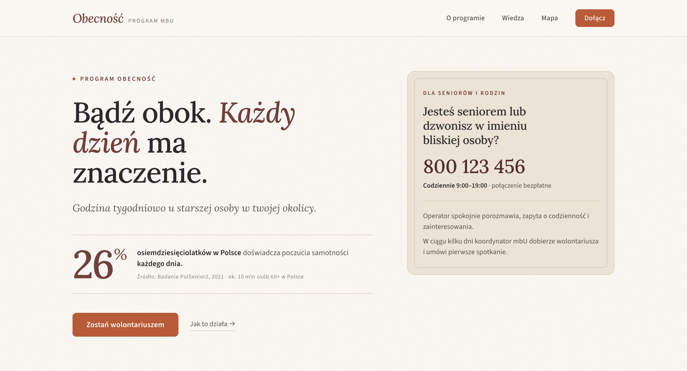

# Obecność

A platform connecting volunteers with lonely seniors, built for **Stowarzyszenie mali bracia Ubogich (mbU)** in under 2 hours during a Vibe Coding Championship (8th place).

**Available at: https://vibe-coding-championship-1.zur-i.com**

---



---

## Quickstart

Requires Docker, Node 20+, and `make`.

```bash
git clone git@github.com:mi-zuri/vibe-coding-championship-1.git
cd vibe-coding-championship-1
make setup   # copies .env, installs deps, boots backend+db
make dev     # backend+db in background, Vite frontend on :5173
```

Open http://localhost:5173. Full command list: `make help`.

## Architecture

```
frontend (Vite, :5173)  ──/api/*──→  backend (Express, :3001)  ──→  Postgres 16
```

- **Frontend** — React 18 + React Router, `frontend/src/`
- **Backend** — Express + `pg`, `backend/src/index.js`, schema in `backend/src/schema.sql`
- **Prod** — Nginx + backend container on EC2, auto-deployed via GitHub Actions on push to `main`

Vite proxies `/api/*` → `:3001` in dev, so `fetch('/api/seniors')` works identically in prod.

Deeper walkthrough: [`docs/Webpage Building Guide.md`](docs/Webpage%20Building%20Guide.md).

## Schema changes

Edit `backend/src/schema.sql` (uses `CREATE TABLE IF NOT EXISTS`). For non-additive
changes run `make reset-db` locally. Production has no migrations — coordinate manually.

## Deploy

`git push origin main` → GitHub Actions deploys to EC2 (~26s). Watch with `gh run watch`.
